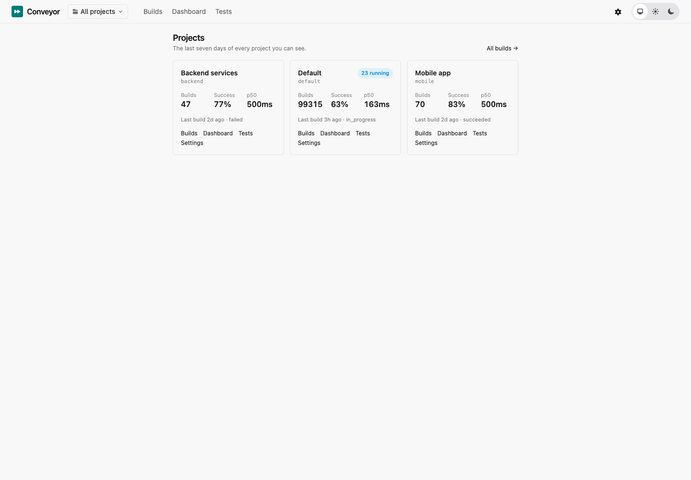
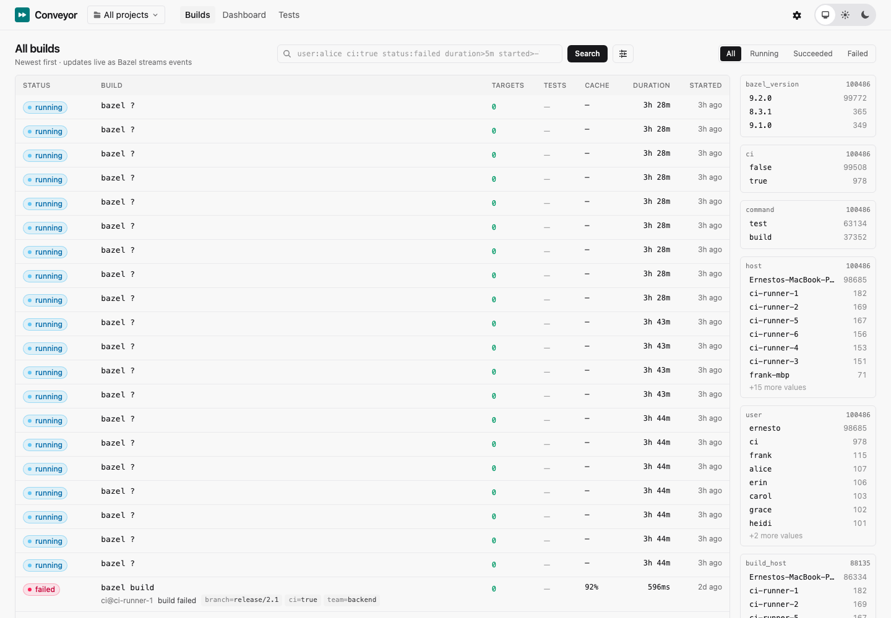

# Conveyor

Self-hosted build observability for [Bazel](https://bazel.build). Conveyor is a
[Build Event Service](https://bazel.build/remote/bep) server with a real-time web UI:
point `--bes_backend` at it and every build shows up live with its log, timeline,
targets, tests, cache statistics and metrics, filterable by any tag you attach with
`--build_metadata`, plus a dashboard of success rate, duration percentiles, cache hit
rate, failures and flaky tests per team, branch or CI segment.

- One binary (Elixir release) + PostgreSQL; S3 for artifacts when running more than one node.
- Acks are the durability boundary: an event is acknowledged only once it is committed,
  and a build resumes on any node after a crash. Measured at 1,000 concurrent streams
  with p99 ack under 150 ms and zero loss through a killed node.
- Logs of any size stream into a virtualized viewer (50 MB renders in a fraction of a second).
- API keys per project for Bazel, OpenID Connect for people, audit log, secret scrubbing.

Status: **0.2.0**, verified end to end with Bazel 7, 8 and 9. Documentation:
**https://erneestoc.github.io/conveyor/** (source in `docs/`).





## Quick start

```sh
git clone https://github.com/erneestoc/conveyor && cd conveyor
docker compose up -d           # PostgreSQL + Conveyor on http://localhost:4000, gRPC :1985
```

Open http://localhost:4000, sign in with the `ADMIN_TOKEN` from `docker-compose.yml`
(change it), create a project and an API key in Settings, then in any Bazel workspace:

```sh
bazel test //... \
  --bes_backend=grpc://localhost:1985 \
  --bes_results_url=http://localhost:4000/invocation/ \
  --bes_header=x-api-key=conveyor_... \
  --build_metadata=TEAM=infra --build_metadata=CI=false
```

Bazel prints the link to the build as it starts. See [docs/bazel.md](docs/bazel.md) for
the full client recipe (upload modes, remote cache, profiles) and
[docs/ci.md](docs/ci.md) for GitHub Actions and Buildkite.

## Deploying

- Image: `ghcr.io/erneestoc/conveyor:0.2.0` (multi-arch, non-root, migrates on boot).
- Helm: `helm install conveyor oci://ghcr.io/erneestoc/charts/conveyor --version 0.2.0`, see
  [docs/kubernetes.md](docs/kubernetes.md) and [deploy/helm/conveyor](deploy/helm/conveyor).
- [docs/production.md](docs/production.md): topology, sizing from the load tests, Postgres
  settings, connection pooling, rollouts, alerts and a go-live checklist.
- [deploy/kubernetes](deploy/kubernetes): plain manifests with a horizontal autoscaler.
- [deploy/aws-asg](deploy/aws-asg): Terraform for an EC2 auto-scaling group.
- [deploy/grafana/conveyor.json](deploy/grafana/conveyor.json): dashboard for the
  Prometheus metrics served at `/metrics`.
- [docs/install.md](docs/install.md): one box with Compose, EC2 with Caddy or a balancer,
  Kubernetes with Helm, each ending with a working Bazel command.
- [docs/capacity.md](docs/capacity.md): measured throughput and sizing starting points.
- [docs/roles.md](docs/roles.md): viewer, project admin, global admin, API key scopes and
  the project boundary.
- [docs/auth.md](docs/auth.md): OpenID Connect and admin access.
  [docs/security.md](docs/security.md): threat model. [docs/cache-endpoints.md](docs/cache-endpoints.md):
  fetching profiles and test logs from your remote cache.

Configuration is by environment variables (`DATABASE_URL`, `SECRET_KEY_BASE`, `PHX_HOST`,
`PORT`, `GRPC_PORT`, `AUTH_MODE`, `BLOB_STORE`, `RETENTION_DAYS`, ...); every variable is
listed with its default in `config/runtime.exs`.

## Development

Requirements: Elixir 1.20+ / OTP 29, Node 20+ (for the log-engine tests), Docker for
PostgreSQL, `protoc` and `protoc-gen-elixir` only if you change the vendored protos.

```sh
docker compose -f docker-compose.dev.yml up -d   # PostgreSQL on 127.0.0.1:5440
mix setup
PORT=4000 mix phx.server                          # web on :4000, BES gRPC on :1985
mix conveyor.seed --replay 1500 --days 30 --big-log 50   # realistic data to browse
```

In development the BES endpoint accepts unauthenticated streams into the `default`
project (set `BES_INGEST_AUTH=api_key` to require keys). Useful commands:

```sh
mix conveyor.replay test/fixtures/bep/*.bep --repeat 10 --concurrency 5 --drop-after 20 --verify
mix conveyor.loadgen --streams 200 --builds 2000 --retries 5 --verify     # or the bes_loadgen escript
mix conveyor.e2e_check --bazel 9.2.0                                       # after a real bazel run
mix precommit                                                              # the CI gate
```

`PLAN.md` holds the roadmap and per-milestone measurements; `HANDOFF.md` the operational
notes for contributors. Fixtures under `test/fixtures/bep/` were recorded from
`test/fixtures/workspace/`; regenerate protobuf modules with `priv/protos/gen.sh`.

## License

MIT. Vendored protocol definitions from Bazel, googleapis and remote-apis are Apache-2.0;
their licenses are kept next to the `.proto` files under `priv/protos/`.
