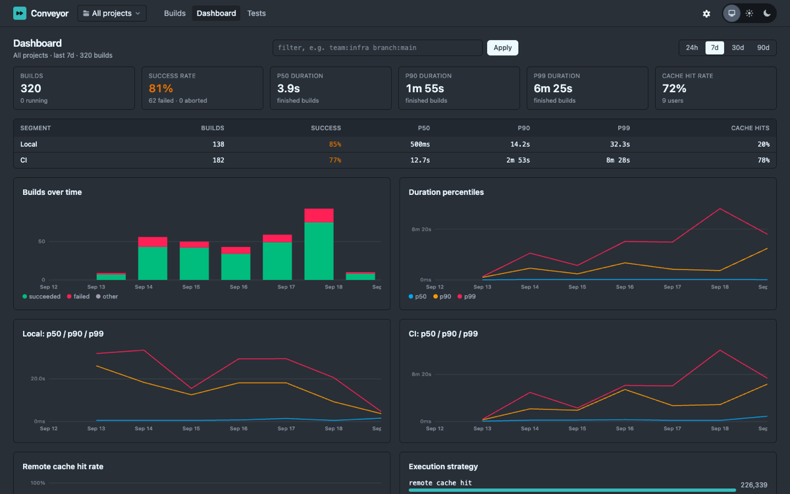

# Conveyor

**Self-hosted build observability for Bazel.** Conveyor is a
[Build Event Service](https://bazel.build/remote/bep) server with a real-time web UI. Point
`--bes_backend` at it and every build shows up as it streams, with its log, timeline,
targets, tests, cache statistics and metrics, filterable by any tag you attach with
`--build_metadata`.

## What you get

- **Every build, live.** The builds list updates as Bazel streams events; a build page
  shows the log as it grows, the failing targets and tests first, the critical path, and
  the per-action timeline once the profile arrives.
- **A query language.** `status:failed branch:main ci:true duration>5m started>-7d`,
  with facets for every tag you send. Tags come from `--build_metadata`, workspace status,
  API keys and Bazel itself (command, version, host, user).
- **Dashboards.** Success rate, p50/p90/p99 duration, cache hit rate, failures by exit
  code and most-failing targets per segment (local vs CI, or any filter), plus a tests
  page that ranks flaky and failing tests across builds.
- **Artifacts.** Profiles and test outputs fetched from your remote cache, or uploaded
  straight into Conveyor's built-in CAS sink; test logs and JUnit XML rendered inline.
- **Durability you can reason about.** An event is acknowledged only once it is committed;
  a build resumes on any node after a crash. Measured: 1,000 concurrent streams at p99 ack
  146 ms and zero loss through a killed node.
- **Runs anywhere.** One release image plus PostgreSQL. Helm chart, Kubernetes manifests
  and EC2 auto-scaling Terraform included; S3 for artifacts when clustered.
- **Access control.** API keys per project with limits, OpenID Connect for people, audit
  log, and secret scrubbing of command lines and logs before they are stored.

## Where to go next

- [Quick start](quickstart.md): running in five minutes with Docker Compose.
- [Configure Bazel](bazel.md): the `.bazelrc` lines, upload modes and what costs build time.
- [Architecture](architecture.md) and [design decisions](decisions.md): how it works and why.
- [Scale and measurements](scale.md): what was measured, on what, and where the limits are.
- [Production guide](production.md) and [Kubernetes and Helm](kubernetes.md).

Conveyor is MIT licensed and verified end to end with Bazel 7, 8 and 9.
